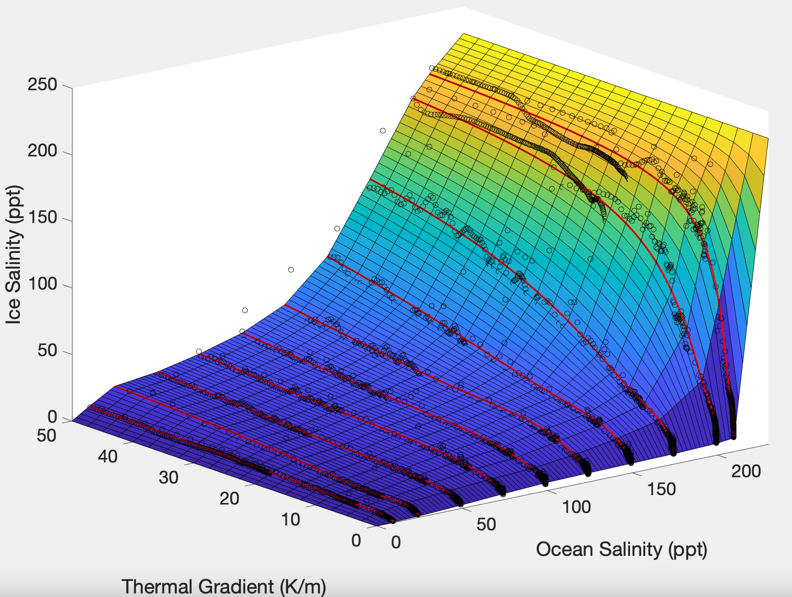

# SOFTsurf

<p align="center">
  
  
  
</p>

This is a code to automatically generate lookup functions for ice salinity (S_ice) as a function of ocean salinity (S_oc) and ice-ocean interface thermal gradient (dT/dz) for binary salt solutions (e.g., NaCl, MgSO4, etc.).

The intention of this model is to derive efficient parameterizations of salt entrainment at ice-ocean and ice-brine interfaces, particularly for larger-scale modelling applications to ice-ocean worlds (e.g., Europa, Enceladus, etc.).

This readme will describe the prerequisites needed to run the model, the basic functionality of the model (how to run it), the model's outputs, and how to implement them.

---

### Disclaimer
This is a work-in-progress, home-built codebase that I use for research. It’s actively evolving and may contain bugs or incomplete features.

If you run into issues, have questions, or would like to contribute, feel free to [open an issue](https://github.com/jbuffo/SOFTsurf/issues) or contact me directly (jacob.j.buffo@dartmouth.edu) — I’ll do my best to help!

---

## Prerequisites
This model uses the existing model SOFTBALL (SOLidification, Flow and Thermodynamics in Binary ALLoys) described in [Parkinson et al., (2020)](https://www.sciencedirect.com/science/article/pii/S2590055219300599). Instructions for downloading SOFTBALL and its supporting software (Chombo) can be found [HERE](https://github.com/jrgparkinson/mushy-layer/tree/master).

The model also uses MATLAB, including its Parallel Computing Toolbox.

NOTE FOR RUNNING SOFTBALL: If you are using a version of MATLAB that is newer than **2023a**, the function 'resizem' is no longer supported and needs to be replaced with 'imresize' in the ChomboLevel.m file. This file can be found at:

**mushy-layer/matlab/ChomboMatlab/ChomboLevel.m**

and the occurrance of 'resizem' is at Line 287.

---

## Downloading SOFTsurf
In terminal
```bash
git clone https://github.com/jbuffo/SOFTsurf.git SOFTsurf
```

---

## Running SOFTsurf
SOFTsurf can be run by editing the run_SOFTsurf.m MATLAB script and then either running that script from the terminal (reccomended) or in MATLAB (less ideal for cluster usage)

OR

Can be called directly from the terminal as a function.

In either case, SOFTsurf is a parallelized code that uses the 'parfor' capabilities of MATLAB's Parallel Computing Toolbox. The model will distribute instances of SOFTBALL simulations across multiple cores (up to the number of 'salinity' values defined).

### Editing run_SOFTsurf.m and running in the terminal
The MATLAB script defines the following variables needed by the code and then runs the makeSurface function. Edit the variables for your specific binary salt solution and simulation environment and save the file.

| Variable   | Description                             | MATLAB Type        | Example Value                                      |
|------------|-----------------------------------------|--------------------|----------------------------------------------------|
| `salinity` | Salinity values to simulate (ppt)       | array (1×N double) | `[10, 25, 50, 75, 100, 125, 150, 175, 200, 210]`   |
| `slope`    | Liquidus slope for salt solution (K/ppt)| scalar (double)    | `-0.0913`                                          |
| `C_e`      | Eutectic concentration (ppt)            | scalar (double)    | `230`                                              |
| `beta`     | Haline contraction coefficient (1/ppt)  | scalar (double)    | `7.6e-4`                                           |
| `g`        | Gravity (m/s²)                          | scalar (double)    | `1.32`                                             |
| `k_s`      | Salt diffusivity in water (m²/s)        | scalar (double)    | `1.5e-9`                                           |
| `saltname` | Name of salt (used in filenames)        | character array    | `'NaCl'`                                           |
| `path`     | Path to SOFTBALL download               | character array    | `'/path/to/file'`                                  |

**NOTE: 'salinity' values MUST be entered in ascending value, and it is not recommended to run values that are within 5% of the eutectic concentration for SOFTBALL stability**

Then in terminal:
```bash
matlab -batch "run_SOFTsurf"
```

### Running the makeSurface function directly from the terminal
```bash
matlab -batch "makeSurface(salinity,slope,C_e,beta,g,k_s,saltname,path);"
```

---

## Model outputs
The model generates the following primary outputs and places them in a folder named after the 'saltname' input:

- **`All_values_array.mat`**  
  A `.mat` file containing a cell array of raw simulation data. The array is size `m × n`, where:  
  - `m` is the number of salinity values specified in the input, and  
  - `n` is the number of predefined simulation resolutions (currently `n = 4`).  
  Each row corresponds to a single salinity value, with columns representing simulations at different resolutions. Additional resolutions can be added by modifying the `makeSurface.m` function. Each cell array entry is a 3 column array of [S_oc, dT/dz, S_ice] values for each SOFTBALL simulation.

- **Goodness-of-fit figure**  
  A saved figure visualizing the fitted surface (meshgrid based on red fit lines) and its agreement with the simulated data (black circles). This helps assess the accuracy of the curve fitting and interpolation.

  <p align="center">
  
  </p>

- **`Surf_<saltname>.mat`**  
  A `.mat` file that includes:  
  - All input parameters  
  - A function object named **`SOFTsurf`**, which includes the function handles **`S_ice`** and **`S_ice_fast`** that can be used to return ice salinity (S_ice) values from anywhere in the interpolated ocean salinity (S_oc) and thermal gradient (dT/dz) space.

---
## Using the lookup functions
The lookup functions `S_ice` and `S_ice_fast` can be loaded into MATLAB via the `Surf_<saltname>.mat` array. Existing arrays associated with different binary salts can be found in the [Salts]() repository.

### Using the `S_ice` Function Handle
(high accuracy using griddata)

You can estimate interpolated ice salinity values using:

```matlab
S_ice = SOFTsurf.S_ice(S_oc, dT_dz);
```

### Using the `S_ice_fast` Function Handle
(high speed [100x `S_ice`] using griddedInterpolant surface, current tests show <2% accuracy loss)

You can estimate interpolated ice salinity values using:

```matlab
S_ice = SOFTsurf.S_ice_fast(S_oc, dT_dz);
```

NOTE: Not valid for S_oc > C_e

<!-- ## Contributing - Push your results to GitHub

I'll be adding new results for different salts as I generate them, but there are **many** to explore. If you've created a new S_ice surface that isn't already included and are willing to contribute it to the catalog, push your 'saltname' folder to the main branch. -->

<!-- ## Citing the code -->

